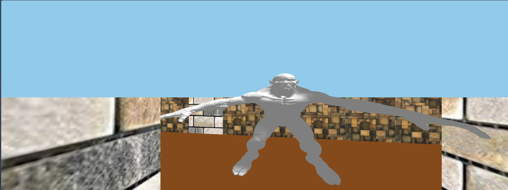

# Maze

<h1>A WebGL maze</h1>

### Launching

There are several ways to launch the game. Here is the simplest:

1. Unzip the zip file
2. Navigate to the directory
3. Start 'python -m SimpleHTTPServer' in your shell (for python 3.0 and above type 'python -m http.server' in your shell)
4. Open 'localhost:8000' in your browser

