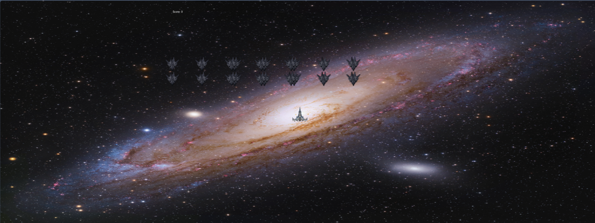

<h3> Other Branches</h3>

-  [A threeJS Scene of a House](https://github.com/stillHere3000/Graphics-ThreeJS/tree/House-Scene)
-  [A threeJS Scene of a Maze](https://github.com/stillHere3000/Graphics-ThreeJS/tree/Maze)
-  [A threeJS Scene of a Forest](https://github.com/stillHere3000/Graphics-ThreeJS/tree/Forests)

<h1>Space Invaders 3D</h1>

Space Invaders 3D is an exciting, fast-paced 3D arcade game inspired by the classic Space Invaders. Players control a spaceship, dodging and destroying alien ships while avoiding incoming fire. The game features stunning 3D graphics, intuitive controls, and challenging gameplay that will keep players engaged for hours.

Features
3D Graphics: Experience the classic Space Invaders gameplay in a new dimension with immersive 3D graphics.
Intuitive Controls: Use arrow keys to move your spaceship and the spacebar to fire missiles.
Challenging Enemies: Face a variety of alien ships that move and attack in different patterns.
Explosions: Enjoy satisfying explosions with particle effects when you destroy enemy ships.
Scoring System: Earn points for each alien ship destroyed and compete for the highest score.
Responsive Design: The game is designed to run smoothly on various screen sizes and resolutions.
How to Play
Move: Use the arrow keys (Up, Down, Left, Right) to move your spaceship.
Fire: Press the spacebar to shoot missiles at the alien ships.
Avoid: Dodge incoming fire from alien ships.
Destroy: Eliminate all alien ships to advance to the next level.
Installation
Clone the repository or download the source code.
Open the index.html file in a modern web browser.
Start playing and enjoy the game!
Technologies Used
Three.js: A powerful JavaScript library for creating 3D graphics in the browser.
JavaScript: The core programming language used to develop the game logic and interactions.
HTML5/CSS3: Used for structuring and styling the game's user interface.
Contributing
We welcome contributions to Space Invaders 3D! If you have any suggestions, bug reports, or enhancements, feel free to open an issue or submit a pull request on our GitHub repository.

License
Space Invaders 3D is open-source software licensed under the MIT License.

Author
Trevor Maliro - Initial work - StillHere3000
Enjoy the game, and may the highest score win!

