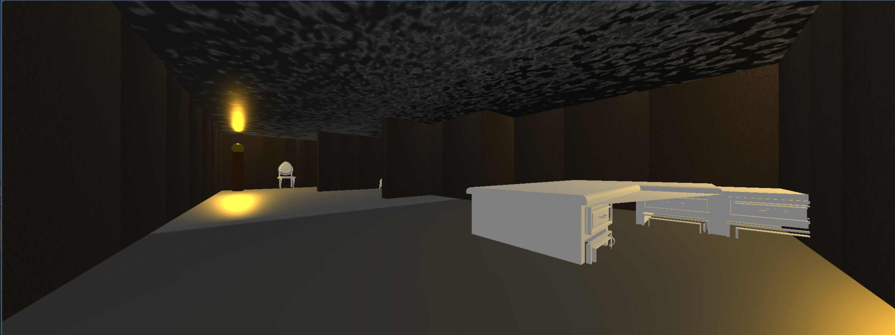
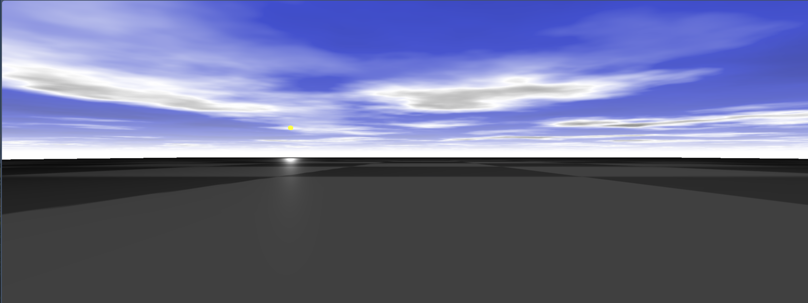

<h1>House Scene Overview</h1>

This project template is designed to create a 3D scene using Three.js. It includes features such as object loading, lighting, camera controls, and post-processing effects. The scene is set up with a floor, walls, a roof, a glass door, and lanterns to create an interactive environment.

Features
Camera Controls: The camera can be moved forward, backward, and rotated using the arrow keys.
Lighting: The scene includes ambient light, spotlights, and point lights to create a realistic lighting effect.
Objects: The template loads multiple 3D objects (e.g., furniture, decorations) and places them in the scene.
Textures: Textures are applied to the floor, walls, roof, and other objects to enhance their appearance.
Post-Processing: The template includes a setup for post-processing effects to add a volumetric light effect to the scene.
Logic Description
Initialization: The scene, camera, renderer, and event listeners are initialized. The camera is positioned and the renderer is appended to the body of the HTML document.

Object Loading: 3D objects are loaded using the OBJLoader and added to the scene. Each object is positioned and scaled appropriately.

World Setup: The floor, walls, roof, and glass door are created using geometries and materials. Textures are applied to these objects to enhance their appearance.

Lighting Setup: Ambient light and spotlights are added to the scene to create a realistic lighting effect. Lanterns are created with point lights to simulate light sources.

Camera Controls: Event listeners are set up to allow the camera to move forward, backward, and rotate using the arrow keys.

Animation Loop: The animate function is called recursively to update the scene and render it. Camera movement is handled in this function based on the pressed keys.

Post-Processing Setup: The setupPostprocessing function sets up the post-processing effects, including the volumetric light effect.

Usage
To run this template, simply open the HTML file in a web browser that supports WebGL. Use the arrow keys to move the camera around the scene and explore the 3D environment.