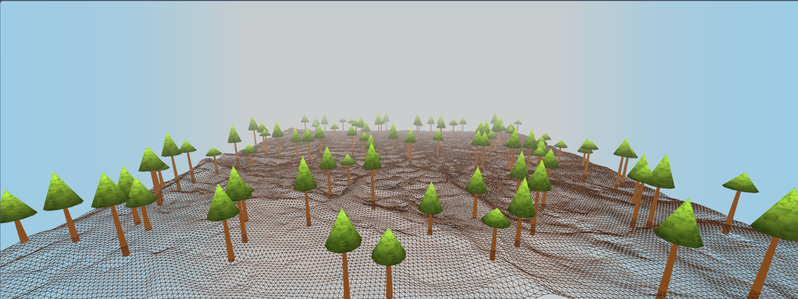

<h1>Three.js Terrain Scene</h1>

This project demonstrates a simple 3D terrain scene using Three.js. It features a textured ground plane representing terrain, randomly placed trees, a skybox for the background, and orbit controls for camera manipulation.

Features
Terrain: A ground plane with elevation data loaded from a .bin file, textured with a ground image.
Trees: Simple tree models created using cylinder and cone geometries, randomly placed on the terrain.
Skybox: A blue sky background created using a box geometry.
Controls: Orbit controls allowing the user to rotate, zoom, and pan the camera.
Setup
To run this project, follow these steps:

Clone or download the repository.
Open the project directory in a terminal or command prompt.
Start a local server (e.g., using Python's http.server or Node.js's http-server).
Open your web browser and navigate to http://localhost:8000 (or the port your server is using).
Usage
Once the scene is loaded, you can interact with it using your mouse or touchpad:

Rotate: Click and drag to rotate the camera around the scene.
Zoom: Scroll up or down to zoom in or out.
Pan: Right-click and drag to pan the camera.
Dependencies
This project uses the following external libraries:

Three.js: A JavaScript 3D library used to create and display animated 3D computer graphics in a web browser.
License
This project is licensed under the MIT License - see the LICENSE file for details.

